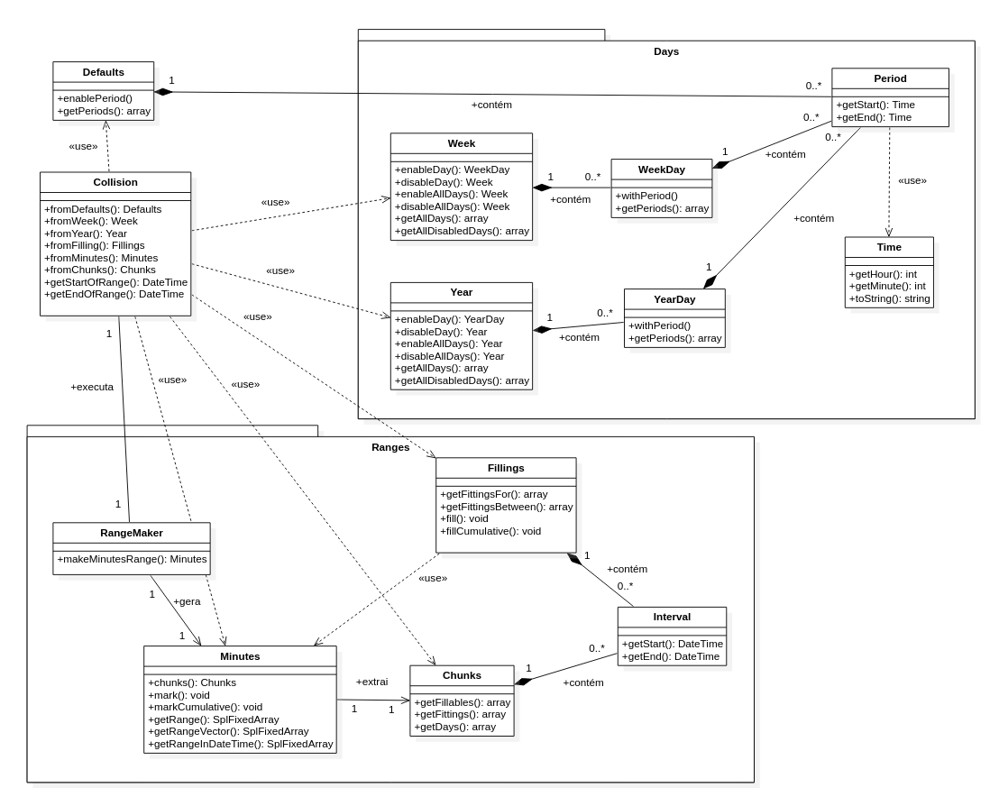

# 5. Arquitetura da biblioteca

## 5.1. Collision

Uma fachada que encapsula todas as funcionalidades interessantes para o usuário.

## 5.2. Parameters

Guarda os parâmetros setados pelo usuário, ao usar a instância de Collision.
Uma instância de Parameters é passada para RangeMaker, permitindo acesso padronizado aos dados
de configuração.

### 5.2.1. Day

Representação contendo os dados de um dia específico do mês (1, 2, 3, 4...).
### 5.2.2. WeekDay

Representação contendo os dados de um dia da semana (segunda, terça, ...).
## 5.3. RangeMaker

É responsável pela criação de uma instância da classe Minutes, usando os parâmetros especificados 
pelo usuario.

## 5.4. Minutes

Contém um intervalo com todos os minutos dentro do período especificado na contrução de Collision.
Os minutos disponíveis podem ser manipulados através de funcionalidades existentes aqui, recebendo 
marcações de estado que determinam se eles podem ser usados ou não.

Para entender melhor o funcionamento do algoritmo, acesse as 
[informações exclusivas da classe Minutes](minutes.md).

## 5.5. Chunks

Funcionalidades para extração de pedaços de tempo, com base nos estados de cada minuto.
Os pedaços são periodos disponíveis para uso dentro do entervalo de tempo especificado
pelo usuario na instancia de Collision.

## Sumário

1.   [Criando intervalos para manipulação](ranges.md)
2.   [Disponibilizando dias e horários utilizáveis](allowance.md)
3.   [Encontrando horários disponíveis](search.md)
4.   [Usando horários disponíveis](fitting.md)
5.   [Arquitetura da biblioteca](architecture.md)
6.   [Algoritmo de colisão](minutes.md)
7.   [Direto ao ponto - API](api.md)
